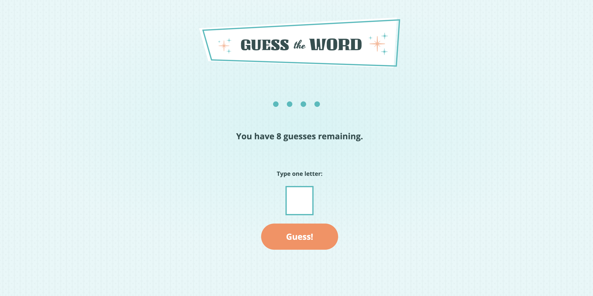

## Table of contents

- [Overview](#overview)
  - [Screenshot](#screenshot)
  - [Links](#links)
- [My process](#my-process)
  - [Built with](#built-with)
  - [What I learned](#what-i-learned)
  - [Continued development](#continued-development)
- [Author](#author)

## Overview

This is a project that I completed using HTML, CSS, Flexbox, and JavaScript.

### Screenshot

### Links

- Live Site URL: (https://rtoddm.github.io/guess-the-word/)

## My process

1. I began by initializing my project as a public repository on (https://github.com/rtoddm/guess-the-word).
2. Then I configured my repository to publish my code to a web address (GitHub pages).
3. I looked through the designs in order to plan how I'd tackle the project. This step is important to help you think through potential CSS classes to create reusable styles.
4. However, before worrying about any styles, I structured my HTML content.
5. I then wrote out the basic styles for my project such as `font-family` and `font-size`, etc.
6. Then I started adding CSS styles to the top of the page and worked down.
7. Lastly I wrote the necessary JavaScript for the functionality of the site.

### Built with

- Semantic HTML5 markup
- CSS custom properties
- Flexbox
- JavaScript

### What I learned

The biggest task for me and greatest learning experience was getting the JavaScript to work correctly.

### Continued development

In the future I plan on working more on my JavaScript so I can more readily create functionality on my sites. I found that implementing the functionality on this site was challenging.

## Author

- Frontend Mentor - [@rtoddm](https://www.frontendmentor.io/profile/rtoddm)
- LinkedIn -[Todd Moussallem](https://www.linkedin.com/in/todd-m-1a7aa8215)
- GitHub -[@rtoddm](https://rtoddm.github.io/git-repo-gallery/)
